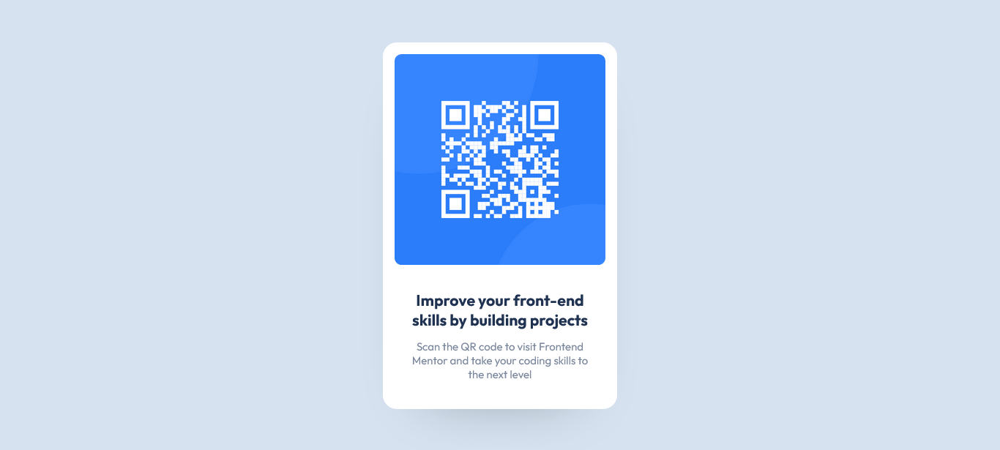

# Frontend Mentor - QR code component solution

This is a solution to the [QR code component challenge on Frontend Mentor](https://www.frontendmentor.io/challenges/qr-code-component-iux_sIO_H). Frontend Mentor challenges help you improve your coding skills by building realistic projects.

## Table of contents

- [Overview](#overview)
  - [Screenshot](#screenshot)
  - [Links](#links)
- [My process](#my-process)
  - [Built with](#built-with)
  - [Useful resources](#useful-resources)
- [Author](#author)

## Overview

### Screenshot

### Links

- Live Site URL: [My Live Site](https://fem-qr-gen.netlify.app/)

## My process

### Built with

- Semantic HTML5 markup
- CSS custom properties
- Flexbox
- CSS Grid
- Mobile-first workflow

### Useful resources

- [CSS hidden Class](https://css-tricks.com/inclusively-hidden/) - This helped me in hiding some html element to make it only accessible to screen readers.
- [CSS reset](https://www.joshwcomeau.com/css/custom-css-reset/) - This helped me in resetting the inital CSS of the browser.

## Author

- Website - [Shah Jahan](https://github.com/Jahan-Shah)
- Frontend Mentor - [@Shah Jahan](https://www.frontendmentor.io/profile/Jahan-Shah)
